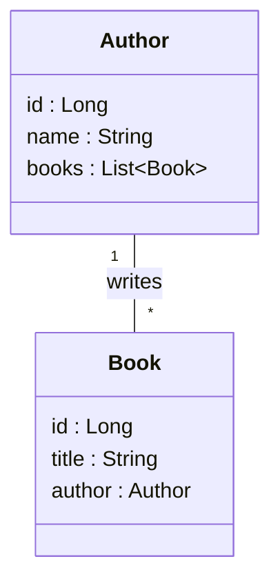

title: Codelab — Spring Boot con JPA: dos entidades (Author, Book)
summary: Aprende a crear una pequeña aplicación Spring Boot que usa Spring Data JPA con dos entidades relacionadas. Guía paso a paso (español).
id: spring-jpa-two-entities-codelab

# Introducción

En este codelab crearás una pequeña aplicación Spring Boot que muestra cómo modelar dos entidades JPA
(Author y Book), persistirlas usando Spring Data JPA (H2 en memoria) y exponer operaciones HTTP básicas.

Duración estimada: 20-30 minutos

## Requisitos previos

- **Entorno de desarrollo:** Visual Studio Code, Github Codespaces o algún otro IDE para Java
- **Ambiente de desarrollo:** Este proyecto incluye un devcontainer. Si no se usa un devcontainer, necesitas instalar
    - Java SDK (JDK) 25 o superior
    - Maven 

## Antes de empezar — Entidades del proyecto

En este repositorio trabajaremos con dos entidades principales: `Author` y `Book`. A continuación hay un diagrama de clases y una tabla que explica cada clase y sus campos.

**Diagrama de clases**



**Tabla explicativa de las clases**

| Clase | Propósito | Campos principales | Notas |
|---|---:|---|---|
| `Author` | Representa un autor en la librería | `id` (Long) — PK, `name` (String), `books` (List<Book>) | Relación `@OneToMany(mappedBy = "author", cascade = CascadeType.ALL, orphanRemoval = true)`. `books` se maneja desde la entidad con `addBook(Book)` para mantener la relación bidireccional.
| `Book` | Representa un libro asociado a un autor | `id` (Long) — PK, `title` (String), `author` (Author) | Relación `@ManyToOne(fetch = FetchType.LAZY)`. `author` referencia al `Author` propietario. Evitar exponer entidades JPA completas en APIs públicas — considera usar DTOs.

Esta breve descripción te ayudará a entender el flujo: el `LibraryService` crea autores y añade libros a un autor existente; los repositorios usan Spring Data JPA para persistir estas entidades.

## Paso 1 — Explorar el repositorio


1. Clona o abra este repositorio

2. Observa la estructura principal del proyecto:

    ```
    ├── pom.xml                   ## configuración de Maven
    ├── README.md                 ## archivo con indicaciones
    ├── src/                      ## carpeta con código fuente
    │   ├── main/                 ## código que se va a desplegar
    │   │   ├── java/             ## - código Java
    │   │   └── resources/        ## - configuración y otros recursos
    │   └── test/                 ## código de pruebas, que no se despliega
    │       ├── java/             ## - código Java
    │       └── resources/        ## - configuración y otros recursos
    └── (otros archivos o configuraciones del entorno)  
    ```

3. Observa los paquetes que se tienen en el proyecto en la carpeta `src/main/java/`

    ```
    (src/main/java/)
    ├── com.example.demo             ## Paquete raíz de la aplicación
    ├── com.example.demo.config      ## Configuración y datos de prueba
    ├── com.example.demo.controller  ## Controladores - responden solicitudes
    ├── com.example.demo.entity      ## Entidades - se almacenan en BD
    ├── com.example.demo.repository  ## Repositorios - manejan operaciones en BD
    └── com.example.demo.service     ## Servicios - Lógica de negocio
    :
    ```

4. Observa los paquetes y las principales clases del proyecto:

- `src/main/java/com/example/demo/entity` — las entidades `Author` y `Book`.
- `src/main/java/com/example/demo/repository` — interfaces `AuthorRepository` y `BookRepository`.
- `src/main/java/com/example/demo/service` — `LibraryService` con la lógica transaccional.
- `src/main/java/com/example/demo/controller` — `LibraryController` que expone endpoints REST.
- `src/main/resources/application.properties` — configura H2 y JPA.

## Paso 2 - Entender el código de las entidades del proyecto

Antes de compilar, revisa cómo están implementadas las entidades JPA y cómo se mapean las relaciones en el código:

1. Revisa el código de la entidad `Author`, que declara una relación `@OneToMany` con `Book`.

    El código incluye una anotación `@OneToMany`

    ```java
    // en la clase Author

    // un Author tiene muchos Book 
    @OneToMany(mappedBy = "author", cascade = CascadeType.ALL, orphanRemoval = true)
    private List<Book> books = new ArrayList<>();

    public void addBook(Book b) {
        books.add(b);
        b.setAuthor(this);
    }

    ```

    Explicación:
    - `mappedBy = "author"` indica que la columna FK se define en `Book` (`Book.author`) y que `Author` es el lado inverso de la relación.
    - `cascade = CascadeType.ALL` hace que las operaciones (persist, merge, remove, etc.) realizadas sobre `Author` se propaguen a sus `books`. Por ejemplo, al guardar un `Author` con libros nuevos, Hibernate persistirá también esos `Book`.
    - `orphanRemoval = true` elimina automáticamente los `Book` que se quitan de la colección `books` (se vuelven huérfanos) cuando se sincroniza la entidad padre.

2. Revisa el código de la clase `Book`, donde se  declara la relación con `Author` así:

    ```java
    // en la clase Book

    // muchos Book tiene un solo Author
    @ManyToOne(fetch = FetchType.LAZY)
    private Author author;
    ```

    Explicación:
    - `@ManyToOne` es el lado propietario; aquí se guarda la FK `author_id` en la tabla `book`.
    - `fetch = FetchType.LAZY` evita cargar el `Author` automáticamente al leer un `Book`, lo que suele ser deseable para rendimiento.


3. Revisa el código que se usaría para agregar y eliminar libros.

    Como las dos clases tienen relaciones, la una con la otra, agregar o eliminar libros de un autor requiere que se ajusten los dos objetos.

    Por ejemplo, el siguiente puede ser código en `Author` para agregar y eliminar libros `Book`


 
    ```java
    // en la clase Author

    // Método helper para agregar y sincronizar ambos lados
    public void addBook(Book b) {
        books.add(b);
        b.setAuthor(this);
    }

    // Método helper para eliminar y sincronizar ambos lados
    public void removeBook(Book b) {
        books.remove(b);
        b.setAuthor(null);
    }

    ```


**Buenas prácticas y notas:**
- Mantén la consistencia del lado "no propietario" (cuando usas relaciones bidireccionales) llamando a helpers como `addBook()` y `removeBook()` para sincronizar ambos lados.
- Ten cuidado con `cascade = CascadeType.REMOVE` (forma parte de ALL): eliminar un `Author` borrará también sus `Book`.
- Para APIs públicas, evita exponer entidades JPA directamente (problemas con lazy loading y acoplamiento). Usa DTOs y mapeo explícito.
- Si necesitas serializar entidades en JSON, maneja la recursión (p. ej. `@JsonManagedReference` / `@JsonBackReference`) o mapear a DTOs.

## Paso 3 - Entender el código de los repositorios

Antes de compilar y ejecutar, revisa cómo están construidos los repositorios y qué capacidades te ofrece Spring Data JPA.

1. Revisa las interfaces `AuthorRepository` y `BookRepository`. En este proyecto son interfaces muy simples que extienden `JpaRepository`:

    Las interfaces que extienden `JpaRepository` tienen dos parámetros: la clase entidad y la clase de la llave primaria.

    En AuthorRepository

    ```java
    package com.example.demo.repository;

    import com.example.demo.entity.Author;
    import org.springframework.data.jpa.repository.JpaRepository;

    // extiende JpaRepository <T, ID>
    // - T, la tabla es Author
    // - ID, la llave primaria es Long
    public interface AuthorRepository extends JpaRepository<Author, Long> {
    }
    ```

    En BookRepository

    ```java
    package com.example.demo.repository;

    import com.example.demo.entity.Book;
    import org.springframework.data.jpa.repository.JpaRepository;

    // extiende JpaRepository <T, ID>
    // - T, la tabla es Book
    // - ID, la llave primaria es Long
    public interface BookRepository extends JpaRepository<Book, Long> {
    }
    ```

**Explicación y ejemplos útiles:**
- Al extender `JpaRepository<T, ID>` obtienes métodos CRUD listos: `save`, `findById`, `findAll`, `deleteById`, etc.
- Puedes definir consultas derivadas por nombre, es decir, se generan el código a partir del nombre de los métodos. Por ejemplo: 

    ```java
    // genera un método para buscar autores por nombre, ignorando mayúscula y minúsculas
    List<Author> findByNameContainingIgnoreCase(String partialName);

    // genera un método para buscar libros usando el Id del author
    List<Book> findByAuthorId(Long authorId);

    // genera un método para buscar libros por título si contienen un texto
    Page<Book> findByTitleContaining(String title, Pageable pageable);
    ```

- Para consultas complejas usa `@Query` con JPQL o SQL nativo:

    ```java
    // genera un método que retorna libros usando el SQL incluido en @Query
    @Query("SELECT b FROM Book b WHERE LOWER(b.title) LIKE LOWER(CONCAT('%', :q, '%'))")
    List<Book> searchByTitle(@Param("q") String q);
    ```

- Spring Data autodetecta las interfaces como beans de repositorio; no es obligatorio añadir `@Repository`.
- Considera usar paginación (`Pageable`) y proyecciones/DTOs para endpoints que devuelven listas grandes.

## Paso 4 — Entender el código de los servicios

En este proyecto la lógica de negocio está en `LibraryService`. 

1. Revisa la definición de la clase y de las dependencias del servicio.

    La clase tiene atributos con los repositorios `AuthorRepository` y `BookRepository`. Al crear un constructor con esos atributos, Spring construye las dependencias de forma automática.  

    ```java
    @Service
    @Transactional
    public class LibraryService {

        // dependencias con los repositorios
        private final AuthorRepository authorRepo;
        private final BookRepository bookRepo;

        // constructor con las dependencias
        // Spring crea los repositorios y los incluye 
        // de forma automática
        public LibraryService(AuthorRepository authorRepo, BookRepository bookRepo) {
            this.authorRepo = authorRepo;
            this.bookRepo = bookRepo;
        }

        // ::
    }
    ```

Explicación:
- `@Service` es un estereotipo de Spring que identifica la clase como un bean de servicio.
- `@Transactional` a nivel de clase hace que, por defecto, los métodos públicos se ejecuten dentro de una transacción. Esto asegura consistencia en operaciones que implican múltiples cambios en la BD y facilita el acceso a colecciones LAZY dentro del alcance del método.

2. Revisa los métodos relevantes del servicio.

    Los servicios deben incluir métodos para los casos de uso del proyecto. Internamente, estos métodos usan los repositorios para acceder y manipular la base de datos.

    ```java
    public Author createAuthor(String name) { ... }

    public Book addBook(Long authorId, String title) { ... }

    public Book getBook(Long id) { ... }

    public List<Author> listAuthors() { ... }
    ```

**Puntos importantes:**
- `createAuthor` delega en `authorRepo.save(...)` para persistir un nuevo autor.
- `addBook` recupera el `Author` por id, crea un `Book` y lo asocia via `a.addBook(b)` (helper del modelo). Dado el `cascade = CascadeType.ALL` en `Author.books`, guardar el `Author` persistirá el `Book` asociado.
- Al lanzar `ResponseStatusException` cuando no se encuentra el autor, el servicio comunica errores significativos que luego el controlador puede propagar como 404 al cliente.
- `getBook` y `listAuthors` usan los repositorios para consultas simples. `getBook` arroja 404 si no encuentra la entidad.

**Buenas prácticas:**
- Mantén la lógica de negocio y reglas en la capa de servicio; el controlador debe permanecer delgado y dedicarse a la interacción HTTP.
- Marca métodos que sólo leen con `@Transactional(readOnly = true)` para optimizar el comportamiento (cache/flush) cuando corresponda.
- Evita exponer entidades JPA directamente en respuestas públicas; usa DTOs y mapeo en la capa de servicio o controlador.


## Paso 5 — Compilar y ejecutar

1. Usa Maven para compilar y ejecutar la aplicación:

    ```bash
    # compila y ejecuta las pruebas
    mvn -DskipTests=false clean package

    # ejecuta la aplicación
    mvn spring-boot:run
    ```

2. Revisa la aplicación.
    - En Visual Studio Code puedes buscar la URL para ver la aplicación en la vista de `Ports` (*Puertos*)
    - Si ejecutas el proyecto en tu máquina local, la aplicación arrancará en `http://localhost:8080` y el `DataSeeder` crea un autor y un libro de ejemplo.

## Paso 6 — Probar los endpoints

- Listar autores:

    ```bash
    curl http://localhost:8080/api/authors
    ```

- Crear un autor:

    ```bash
    curl -X POST "http://localhost:8080/api/authors?name=Isabel+Allende"
    ```

- Añadir un libro a un autor (suponiendo id=1):

    ```bash
    curl -X POST "http://localhost:8080/api/authors/1/books?title=La+Casa+de+los+Espíritus"
    ```

## Qué aprendimos aquí

- Cómo mapear relaciones @OneToMany / @ManyToOne y manejar cascadas.
- Uso de Spring Data JPA (repositorios que extienden `JpaRepository`).
- Separación clara entre controller/service/repository.

## Siguientes pasos

Este proyecto puede ser mejorado de varias formas. Por ejemplo, tu puedes,
- Añadir DTOs y mapeo de correspondencias con MapStruct, para no exponer las entidades directamente a los clientes.
- Implementar pruebas de integración más completas.
- Añadir paginación y búsquedas en los métodos de consulta de `BookRepository`.

